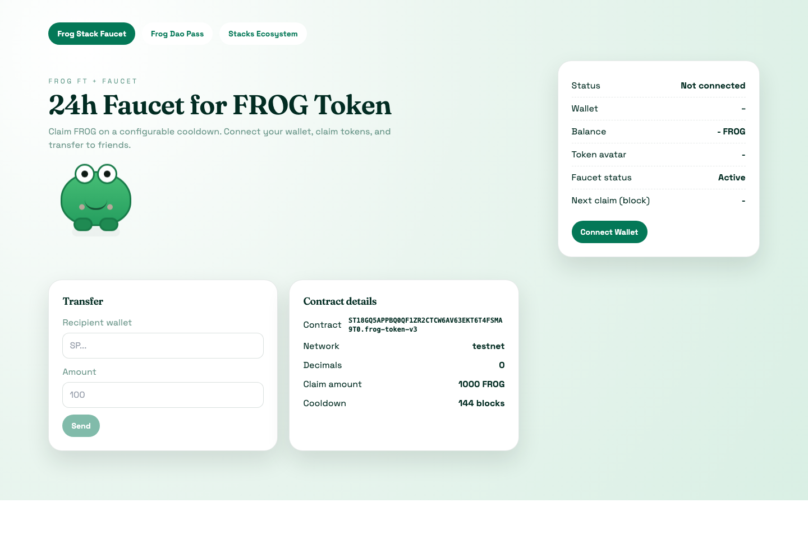
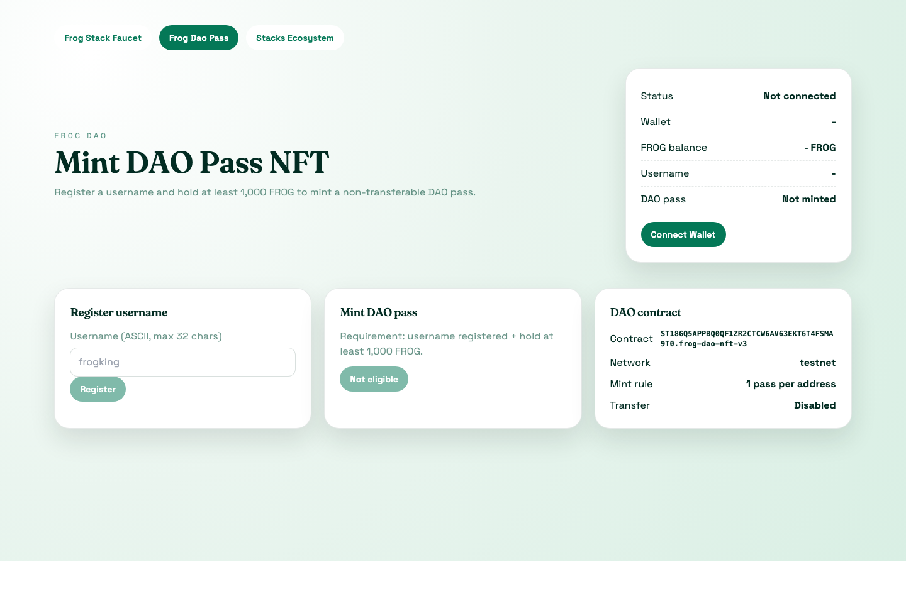
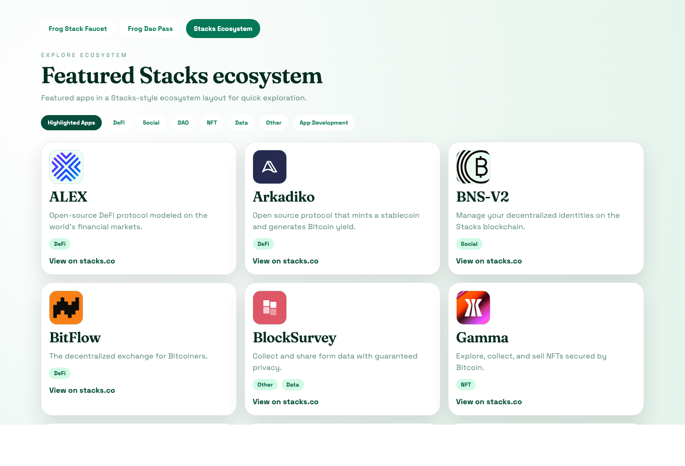

# FROG FT + Faucet (24h cooldown)

MVP includes:
- Fungible Token `FROG` (decimals = 0)
- Faucet allows each address to claim 1,000 FROG every 24h (~144 blocks)
- DAO NFT: register username + hold 1,000 FROG and pay 99 FROG fee to mint a non-transferable membership pass
- React + Vite frontend: connect wallet, claim, view balance, transfer
- Faucet admin controls: pause/unpause, set claim amount, set cooldown blocks (owner-only)

## Contracts

```bash
clarinet check
clarinet console
```

Active contracts:
- `contracts/frog-token-v3.clar`
- `contracts/frog-dao-nft-v4.clar`

Archived (legacy) contracts:
- `contracts/archive/frog-token.clar`
- `contracts/archive/frog-dao-nft.clar`
- `contracts/archive/frog-dao-nft-v3.clar`

### Faucet admin functions (`frog-token-v3`)

Only contract deployer (`contract-owner`) can call:
- `set-faucet-paused (paused bool)`
- `set-faucet-amount (amount uint)` (must be `> u0`)
- `set-cooldown-blocks (blocks uint)` (must be `> u0`)

Read config:
- `get-faucet-config` -> `{ owner, amount, cooldown, paused }`
- `get-token-uri` -> metadata URL for wallet/explorer token image + info

Metadata sample:
- `metadata/frog-token-v3.metadata.json`
- Update `token-uri` constant in `contracts/frog-token-v3.clar` to your hosted HTTPS JSON URL before production deploy.

## Secure Local Setup

Run once after cloning:

```bash
./scripts/bootstrap-local-config.sh
./scripts/install-hooks.sh
```

What this does:
- creates local config files from templates
- installs pre-commit hook for secret scanning and active-contract checks

Local files generated (ignored by git):
- `settings/Testnet.toml`
- `settings/Mainnet.toml`
- `frontend/.env`

Template files tracked in git:
- `settings/Testnet.toml.example`
- `settings/Mainnet.toml.example`
- `frontend/.env.example`

## Frontend

```bash
cd frontend
npm install
npm run dev
```

## Demo Screenshots

### Faucet tab


### DAO tab


### Ecosystem tab


## Deploy Testnet

1. Fill mnemonic in local file `settings/Testnet.toml`.
2. Generate deployment plan:

```bash
clarinet deployments generate --testnet --manual-cost
```

3. Review `deployments/default.testnet-plan.yaml`.
4. Apply deployment:

```bash
clarinet deployments apply --testnet --no-dashboard --use-on-disk-deployment-plan
```

## Deploy Mainnet

1. Fill mnemonic in local file `settings/Mainnet.toml`.
2. Generate deployment plan:

```bash
clarinet deployments generate --mainnet --manual-cost
```

3. Review `deployments/default.mainnet-plan.yaml`:
- `expected-sender` matches your deployer address
- contracts listed: `frog-token-v3`, `frog-dao-nft-v4`
- costs are acceptable

4. Apply deployment:

```bash
clarinet deployments apply --mainnet --no-dashboard --use-on-disk-deployment-plan
```

5. Update local frontend env `frontend/.env`:
- `VITE_CONTRACT_ADDRESS=<mainnet deployer address>`
- `VITE_CONTRACT_NAME=frog-token-v3`
- `VITE_DAO_CONTRACT_ADDRESS=<mainnet deployer address>`
- `VITE_DAO_CONTRACT_NAME=frog-dao-nft-v4`
- `VITE_HIRO_PROXY=` (empty for production build)

## Mainnet Deployment (Live)

- `SP18GQ5APPBQ0QF1ZR2CTCW6AV63EKT6T4EFYJMNW.frog-token-v3`
  - txid: `c4128cd67b5cfacbfe730b03e3f35eb07622e8a0b92b9f39765483dae3524ec0`
- `SP18GQ5APPBQ0QF1ZR2CTCW6AV63EKT6T4EFYJMNW.frog-dao-nft-v4`
  - txid: `e543360e960a7ea0bfe0e8cebaf00fefee95583e44b1a396ef06bc06a113f612`

## Secret Scan (Pre-commit)

Pre-commit hook requires `gitleaks` installed locally.

Install on macOS:

```bash
brew install gitleaks
```

The hook scans staged changes and blocks commits containing potential secrets.

## Important Security Note

A mnemonic was previously exposed in this repository history. You should rotate those wallets and move funds to new keys.
