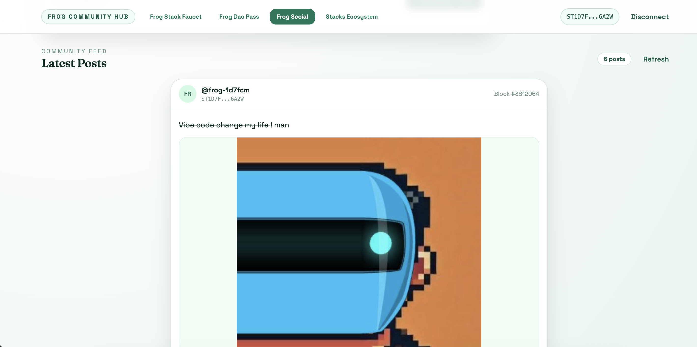
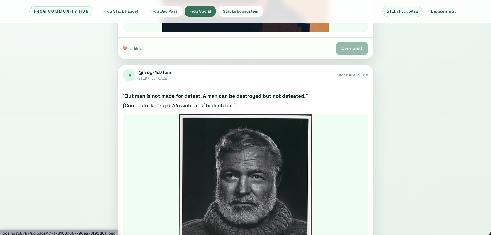

# FROG Community Hub

FROG Community Hub is a Stacks dApp focused on onboarding and community activity around FROG token: faucet, DAO pass, social feed, ecosystem discovery, and owner admin controls.

## Demo






## Current Features

- FROG fungible token (`decimals = 0`) via `frog-token-v3`
- Faucet with configurable amount/cooldown and transfer support
- DAO Pass via `frog-dao-nft-v5`
  - register username
  - mint one non-transferable pass
- Social Feed via `frog-social-v1`
  - publish post fee: `50 FROG`
  - like fee: `5 FROG`
  - one-like-per-wallet
  - no self-like
  - hybrid data model:
    - on-chain: author, content hash, likes, block
    - backend: post text + links by content hash
- Admin tab (owner only) for faucet controls
- Ecosystem tab with curated Stacks apps

## Frontend Tabs

- `Faucet`
- `Frog DAO Pass`
- `Social Feed`
- `Admin` (only visible when connected wallet is owner)
- `Stacks Ecosystem`

## Contracts

Active contracts:
- `contracts/frog-token-v3.clar`
- `contracts/frog-dao-nft-v5.clar`
- `contracts/frog-social-v1.clar`

Quick checks:

```bash
clarinet check
clarinet console
```

## Local Setup

```bash
./scripts/bootstrap-local-config.sh
./scripts/install-hooks.sh
```

This creates local config files (gitignored):
- `settings/Testnet.toml`
- `settings/Mainnet.toml`
- `frontend/.env`

## Run Frontend

```bash
cd frontend
npm install
# optional: cp .env.example .env and edit values
npm run dev
```

## Run Backend (Social API)

```bash
cd backend
npm install
# optional: cp .env.example .env and edit values
npm run dev
```

Backend environment (`backend/.env`):
- `BACKEND_PORT=8787`
- `BACKEND_PUBLIC_BASE_URL=<optional, used for production uploaded-image URLs>`

## Frontend Environment (`frontend/.env`)

Use env files by mode:
- `frontend/.env.development` for local dev
- `frontend/.env.production` for production

- `VITE_STACKS_NETWORK=testnet|mainnet`
- `VITE_CONTRACT_ADDRESS=<deployer>`
- `VITE_CONTRACT_NAME=frog-token-v3`
- `VITE_DAO_CONTRACT_ADDRESS=<deployer>`
- `VITE_DAO_CONTRACT_NAME=frog-dao-nft-v5`
- `VITE_SOCIAL_CONTRACT_ADDRESS=<deployer>`
- `VITE_SOCIAL_CONTRACT_NAME=frog-social-v1`
- `VITE_SOCIAL_API_BASE_URL=<your backend API base URL>`
- `VITE_HIRO_API_BASE_URL=<optional>`

## Deploy (Testnet)

1. Fill mnemonic in `settings/Testnet.toml`.
2. Generate plan:

```bash
clarinet deployments generate --testnet --manual-cost
```

3. Review `deployments/default.testnet-plan.yaml`.
4. Apply plan:

```bash
clarinet deployments apply --testnet --no-dashboard --use-on-disk-deployment-plan
```

## Notes

- Backend runtime data is stored at `backend/data/posts.json`.
- `backend/data/posts.json` is ignored by git (local runtime data only).
