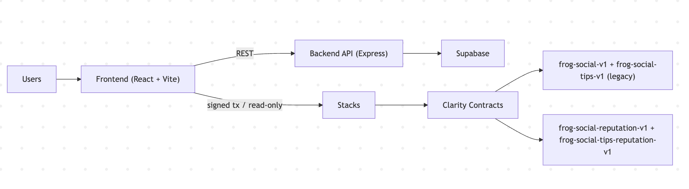

# FROG Community Hub

Stacks dApp for FROG community operations: faucet, DAO pass, social posting, and STX tipping.

## Quickstart

```bash
# 1) bootstrap local config
cd /Users/vanhuy/Documents/stacks-frog-community-hub
./scripts/bootstrap-local-config.sh

# 2) run backend (testnet)
cd backend && npm install && npm run dev

# 3) run frontend (testnet)
cd ../frontend && npm install && npm run dev:testnet
```

## Tech Stack

- Frontend: React + Vite
- Backend: Node.js + Express
- On-chain: Clarity (Stacks)
- Off-chain storage: Supabase
- Wallet/Tx SDKs: `@stacks/connect`, `@stacks/transactions`

## Contracts

Declared in `Clarinet.toml`:

- `contracts/frog-token-v3.clar`
- `contracts/frog-dao-nft-v5.clar`
- `contracts/frog-social-v1.clar` (legacy)
- `contracts/frog-social-reputation-v1.clar` (current testnet social)
- `contracts/frog-social-tips-v1.clar` (legacy)
- `contracts/frog-social-tips-reputation-v1.clar` (current testnet tips)

## Architecture



## Project Structure

- `contracts/`: Clarity contracts
- `frontend/`: React app
- `backend/`: social API and tip sync verification
- `deployments/`: deployment plans
- `scripts/`: helper scripts for setup and deploy
- `settings/`: local Clarinet network settings (gitignored copies)

## Prerequisites

- Node.js 18+
- npm
- Clarinet

## Environment Configuration

### Frontend (testnet)

Use `frontend/.env.development`:

- `VITE_STACKS_NETWORK=testnet`
- `VITE_CONTRACT_ADDRESS=<deployer>`
- `VITE_CONTRACT_NAME=frog-token-v3`
- `VITE_DAO_CONTRACT_ADDRESS=<deployer>`
- `VITE_DAO_CONTRACT_NAME=frog-dao-nft-v5`
- `VITE_SOCIAL_CONTRACT_ADDRESS=<deployer>`
- `VITE_SOCIAL_CONTRACT_NAME=frog-social-reputation-v1`
- `VITE_SOCIAL_TIPS_CONTRACT_ID=<deployer>.frog-social-tips-reputation-v1`
- `VITE_SOCIAL_TIPS_CONTRACT_ADDRESS=<deployer>`
- `VITE_SOCIAL_TIPS_CONTRACT_NAME=frog-social-tips-reputation-v1`
- `VITE_SOCIAL_API_BASE_URL=<backend base url>`
- `VITE_HIRO_API_BASE_URL=https://api.testnet.hiro.so`

### Frontend (mainnet)

Use `frontend/.env.production`.

Current production defaults remain on legacy social/tips pair unless explicitly migrated.

### Backend (testnet)

Use `backend/.env`:

- `BACKEND_PORT=8787`
- `BACKEND_STACKS_NETWORK=testnet`
- `HIRO_API_BASE_URL=https://api.testnet.hiro.so`
- `TIPS_CONTRACT_ID=<deployer>.frog-social-tips-reputation-v1`
- `SUPABASE_URL=<https://your-project.supabase.co>`
- `SUPABASE_SERVICE_ROLE_KEY=<service role key>`
- `SUPABASE_STORAGE_BUCKET=frog-uploads`

## Run

### Frontend

```bash
cd /Users/vanhuy/Documents/stacks-frog-community-hub/frontend
npm run dev:testnet
npm run dev:mainnet
npm run build:testnet
npm run build:mainnet
```

### Backend

```bash
cd /Users/vanhuy/Documents/stacks-frog-community-hub/backend
npm run dev
```

## Deploy Contracts

### Generic Scripts

```bash
cd /Users/vanhuy/Documents/stacks-frog-community-hub
./scripts/contracts-generate.sh testnet
./scripts/contracts-apply.sh testnet

./scripts/contracts-generate.sh mainnet
./scripts/contracts-apply.sh mainnet
```

### Safe Testnet Migration Plans

Use dedicated plans to avoid touching legacy contracts:

- `deployments/testnet-social-reputation-only.yaml`
- `deployments/testnet-social-tips-reputation-only.yaml`

Apply:

```bash
clarinet deployments apply -p deployments/testnet-social-reputation-only.yaml --no-dashboard
clarinet deployments apply -p deployments/testnet-social-tips-reputation-only.yaml --no-dashboard
```

## Verification Checklist

```bash
cd /Users/vanhuy/Documents/stacks-frog-community-hub
clarinet check

cd frontend
npm run build:testnet
npm run build:mainnet
```

Manual checks:

- Connect wallet
- Publish post
- Verify `Rep` badge appears
- Like from another wallet and confirm rep increments
- Tip a post and verify `/tips` sync succeeds

## Operational Notes

- `frog-social-v1` and `frog-social-tips-v1` are kept for backward compatibility.
- Reputation flow should use `frog-social-reputation-v1` + `frog-social-tips-reputation-v1` together.
- Backend tip verification depends on `TIPS_CONTRACT_ID`; ensure it matches active tips contract.

## Contributing

- Open issue with expected behavior and reproduction steps.
- Keep PRs focused (contract/frontend/backend/docs separated where possible).
- Run `clarinet check` and frontend builds before requesting review.

## Security

- Never commit secrets.
- Keep real keys only in local `.env` or deployment platform env vars.

